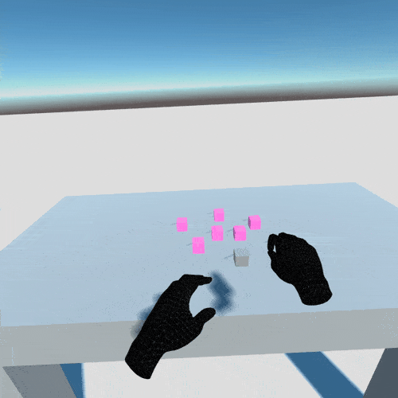

<h2> SwarmBody project prototype

A unity project for prototyping "swarm as a body part".

---

## Environment

- Unity 2019 4.15f1 LTS __with arduino build support__ (you need to "Add Modules" from the Unity Hub)
- Oculus Quest
- Valid USB C Cable for uploading project

## TODOs

- read skeleton data then remap it to 2D space somehow.
- possible gesture recognition

